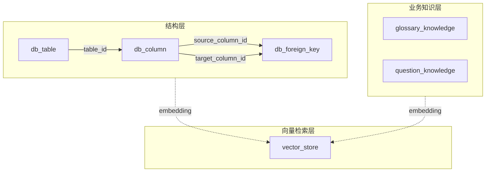
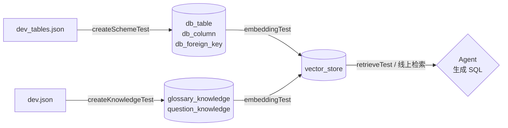

# data-agent 数据说明

> 本文档解释：项目里的"数据"到底来自哪里、每张表是干嘛的、为什么这样设计。
>
> 配套文档：
> - 数据库容器启动见 [DOCKER.md](./DOCKER.md)
> - 业务表 DDL 见 [database.sql](./data-agent-backend/src/main/resources/database.sql)

---

## 一、原始数据：BIRD-SQL 数据集

我们用的不是自家业务库的数据，而是公开的 **BIRD-SQL** Text-to-SQL 评测数据集
（Benchmark for Large Language Models on Realistic Database for Cross-Domain Text-to-SQL Tasks）。
它的定位很简单：**给"自然语言转 SQL"任务提供一批真实复杂数据库 + 标注好的问答对**。

文件位置：[data-agent-backend/src/main/resources/dev_20240627](./data-agent-backend/src/main/resources/dev_20240627)

我们实际用到的关键文件：

| 文件 | 是什么 | 用来做什么 |
| --- | --- | --- |
| `dev_tables.json` | 11 个业务库的 schema 描述（表名、列名、列类型、主键、外键） | 灌进 `db_table` / `db_column` / `db_foreign_key` |
| `dev.json` | 1534 道"自然语言问题 + 标准 SQL 答案 + evidence（业务背景知识）" | 灌进 `question_knowledge`（问/SQL）和 `glossary_knowledge`（evidence） |
| `dev_databases.zip` | 11 个 SQLite 物理库文件 | 暂未使用，留给后续真正执行 SQL 时挂业务库用 |

### `dev_tables.json` 长什么样（节选）

```json
{
  "db_id": "california_schools",
  "table_names_original": ["frpm", "satscores", "schools"],
  "table_names":          ["FRPM", "SAT Scores", "Schools"],
  "column_names_original": [[-1,"*"], [0,"CDSCode"], [0,"Academic Year"], ...],
  "column_names":          [[-1,"*"], [0,"CDSCode"], [0,"Academic Year"], ...],
  "column_types": ["text","text","text", ...],
  "primary_keys": [1, 35, 65],
  "foreign_keys": [[2, 65], [33, 65]]
}
```

要点：
- `column_names_original[i] = [tableIndex, colName]`，前一位是这一列归属哪张表（在 `table_names_original` 里的下标）。
- `foreign_keys = [[srcColIdx, tgtColIdx], ...]`，外键也是用"列下标"互指。
- 这是一种紧凑的索引式表达，**人不好读、机器不好直接用**——这就是为什么我们需要把它"展开"成关系表。

### `dev.json` 长什么样（节选）

```json
{
  "question_id": 0,
  "db_id": "california_schools",
  "question": "What is the highest eligible free rate for K-12 students in the schools in Alameda County?",
  "evidence": "Eligible free rate for K-12 = `Free Meal Count (K-12)` / `Enrollment (K-12)`",
  "SQL": "SELECT `Free Meal Count (K-12)` / `Enrollment (K-12)` FROM frpm WHERE ... ",
  "difficulty": "simple"
}
```

要点：
- `question` 是用户用自然语言提的问题。
- `SQL` 是该问题的标准答案。
- `evidence` 是回答这个问题需要懂的"业务背景知识"——比如 K-12 减免率的计算口径。这是 BIRD 数据集相对其他 Text-to-SQL 数据集最值钱的部分。

---

## 二、我们的数据库为什么长这样

我们的目标是一个 **Text-to-SQL Agent**：用户用大白话提问，Agent 要生成可执行的 SQL。
要做好这件事，光把问题丢给大模型是不够的，还得给它两类上下文：

1. **结构上下文**：这个库里有哪些表、哪些列、列是什么类型、表与表之间什么关系。
   → 对应 `db_table` / `db_column` / `db_foreign_key`
2. **业务上下文**：业务术语怎么解释、过去类似的问题是怎么写 SQL 的。
   → 对应 `glossary_knowledge` / `question_knowledge`

再加上 Spring AI 帮我们建的：
3. **向量上下文**：把以上四类知识转成向量，按相似度召回最相关的几条喂给大模型。
   → 对应 `vector_store`

所以最终我们一共 **6 张表**，分三层。



---

## 三、5 张业务表逐个解释

字段类型以 [database.sql](./data-agent-backend/src/main/resources/database.sql) 为准。

### 1. `db_table`：库里有哪些表

| 字段 | 类型 | 说明 |
| --- | --- | --- |
| `id` | UUID | 主键 |
| `name` | varchar | 表名（原始名，例如 `frpm`） |
| `description` | text | 表的可读描述（例如 `FRPM`） |
| `database_id` | varchar | 所属业务库的标识（例如 `california_schools`） |
| 唯一约束 | `(database_id, name)` | 同一个库里表名不重复 |

> 数据来自 `dev_tables.json` 的 `table_names_original` + `table_names`。

### 2. `db_column`：表里有哪些列

| 字段 | 类型 | 说明 |
| --- | --- | --- |
| `id` | UUID | 主键 |
| `name` | varchar | 列原始名（例如 `CDSCode`） |
| `type` | varchar | 列类型（例如 `text` / `integer` / `real`） |
| `description` | text | 列的可读描述（例如 `California Department Schools Code`） |
| `is_primary_key` | bool | 是否主键 |
| `table_id` | UUID | 所属 `db_table.id`，删表级联删列 |
| 唯一约束 | `(table_id, name)` | 同一张表里列名不重复 |

> 数据来自 `dev_tables.json` 的 `column_names_original` + `column_names` + `column_types` + `primary_keys`。

### 3. `db_foreign_key`：表与表的关系

| 字段 | 类型 | 说明 |
| --- | --- | --- |
| `id` | UUID | 主键 |
| `source_column_id` | UUID | 外键所在列（"我引用别人"） |
| `target_column_id` | UUID | 被引用列（通常是另一表的主键） |
| 唯一约束 | `(source_column_id, target_column_id)` | 同一对外键关系不重复 |

> 数据来自 `dev_tables.json` 的 `foreign_keys`。
> 我们没有直接存"列下标"，而是先把列灌进 `db_column` 拿到 UUID，再把外键的 src/tgt 替换成 UUID。
> 这样后续 join 是真正的关系，而不是脆弱的下标。

### 4. `glossary_knowledge`：业务术语 / 计算口径

| 字段 | 类型 | 说明 |
| --- | --- | --- |
| `id` | UUID | 主键 |
| `database_id` | varchar | 所属业务库 |
| `term` | varchar | 术语名（BIRD 里 evidence 没有显式 term，目前先存空串） |
| `description` | text | 术语解释 / 计算口径 |
| `synonyms` | varchar | 同义词，可空 |

> 数据来自 `dev.json` 的 `evidence` 字段，按内容去重。
> **它的价值**：告诉模型"K-12 减免率 = `Free Meal Count (K-12)` / `Enrollment (K-12)`"这种业务规则，仅靠 schema 是猜不出来的。

### 5. `question_knowledge`：历史问答（few-shot 样本库）

| 字段 | 类型 | 说明 |
| --- | --- | --- |
| `id` | UUID | 主键 |
| `database_id` | varchar | 所属业务库 |
| `question` | text | 自然语言问题 |
| `answer` | text | 标准 SQL |

> 数据来自 `dev.json` 的 `question` + `SQL`，1534 条。
> **它的价值**：检索阶段拉出"和当前问题最像的几条历史问答"，让模型照着写——这就是经典的 few-shot retrieval。

---

## 四、向量表 `vector_store`（Spring AI 自动建）

应用启动时由 `PgVectorStoreAutoConfiguration` 自动创建，表结构大致为：

| 字段 | 类型 | 说明 |
| --- | --- | --- |
| `id` | UUID | 主键 |
| `content` | text | 原文（被嵌入的那段文字） |
| `metadata` | jsonb | 元数据，关键字段：`vectorType`（TABLE/COLUMN/QUESTION/GLOSSARY）、`databaseId` |
| `embedding` | vector(1024) | 1024 维向量（DashScope `text-embedding-v4`） |

灌入由 [DatasetEmbeddingTest](./data-agent-backend/src/test/java/com/libambu/dataagent/dataset/DatasetEmbeddingTest.java) 完成：把 `db_table` / `db_column` / `question_knowledge` / `glossary_knowledge` 4 类记录通过 `DocumentMapper` 转成 `Document` 后批量写入。

> ⚠️ HNSW 索引限制最大 2000 维，所以我们用 1024 维而不是 2048 维。

### 一条数据的完整旅程（以 `frpm` 表为例）

光看字段表很抽象，下面用 `california_schools` 库里的 `frpm` 表跟踪一遍，从原始 JSON 到向量库里的一行：

**Step 1：原始 JSON（`dev_tables.json` 中的一段）**

```json
{
  "db_id": "california_schools",
  "table_names_original": ["frpm", "satscores", "schools"],
  "table_names":          ["FRPM", "SAT Scores", "Schools"]
}
```

**Step 2：`createSchemeTest` 灌进 `db_table` 表（PG 关系表，1 行）**

| id | name | description | database_id |
| --- | --- | --- | --- |
| `9f1e…003` | `frpm` | `Free or Reduced Price Meals` | `california_schools` |

**Step 3：`embeddingTest` 把这一行映射成 `Document` 对象**

由 [DocumentMapper#toDocument(DbTable)](./data-agent-backend/src/main/java/com/libambu/dataagent/agent/DocumentMapper.java) 完成，规则是 `content = description`、`metadata` 打三个标签：

```json
{
  "content": "Free or Reduced Price Meals",
  "metadata": {
    "vectorType": "table",
    "databaseId": "california_schools",
    "tableId":    "9f1e...003"
  }
}
```

**Step 4：`vectorStore.add(...)` 调 DashScope `text-embedding-v4` 算向量，写入 `vector_store`（1 行）**

| id | content | metadata (jsonb) | embedding (vector(1024)) |
| --- | --- | --- | --- |
| 自动生成 | `Free or Reduced Price Meals` | `{"vectorType":"table","databaseId":"california_schools","tableId":"9f1e...003"}` | `[0.0123, -0.0476, 0.0891, …]` 共 1024 维 |

> 注意：`embedding` 是用 `content` 那段英文算出来的，**不是**用整行 JSON 算的。`metadata` 只是标签，不参与算向量，但参与检索时的过滤。

**Step 5：检索时怎么命中它**

`retrieveTest` 里的查询用了 `filter: vectorType=table AND databaseId=california_schools`，这条 `frpm` 行先被过滤命中，再算与 query 的相似度——用户问"学校减免率最高的县"时，由于 query 向量和 `Free or Reduced Price Meals` 这条向量在语义上接近，它会出现在 topK 结果里，从而告诉 Agent："这个问题应该用 `frpm` 表"。

---

`db_column` / `question_knowledge` / `glossary_knowledge` 是同样的套路，只是 `content` 取的字段不同、`metadata.vectorType` 不同：

| 来源表 | 一行变成 Document 时 content 取自 | vectorType |
| --- | --- | --- |
| `db_table` | `description`（如 `Free or Reduced Price Meals`） | `table` |
| `db_column` | `description`（如 `California Department Schools Code`） | `column` |
| `question_knowledge` | `question`（自然语言问题原文） | `questionKnowledge` |
| `glossary_knowledge` | `"业务名词:… 说明:… 同义词:…"` 拼出的字符串 | `glossaryKnowledge` |

所以 `california_schools` 这一个库灌完之后，`vector_store` 里大约会多出：3 行 table + 几十行 column + 89 行 question + 80 行左右 glossary，总共一两百行向量。

### metadata 为什么要打 `vectorType` 和 `databaseId`

检索时不是"在所有向量里乱搜"，而是要先按业务过滤，比如：

```
找 vectorType=table 且 databaseId=california_schools 的 top-5
```

这样才能保证："找表用的查询，不会召回到一条 evidence"、"A 库的问题，不会召回到 B 库的列"。

---

## 五、数据流总览



对应到代码：
- 灌结构：[BirdSqlDatasetImportTest#createSchemeTest](./data-agent-backend/src/test/java/com/libambu/dataagent/dataset/BirdSqlDatasetImportTest.java)
- 灌知识：[BirdSqlDatasetImportTest#createKnowledgeTest](./data-agent-backend/src/test/java/com/libambu/dataagent/dataset/BirdSqlDatasetImportTest.java)
- 向量化：[DatasetEmbeddingTest#embeddingTest](./data-agent-backend/src/test/java/com/libambu/dataagent/dataset/DatasetEmbeddingTest.java)
- 检索验证：[DatasetEmbeddingTest#retrieveTest](./data-agent-backend/src/test/java/com/libambu/dataagent/dataset/DatasetEmbeddingTest.java)

---

## 六、几个常见疑问

**Q1：为什么不直接让大模型读 `dev_tables.json`？**
- 一次塞 11 个库的 schema 进 prompt，token 爆炸且不相关信息太多；
- 拆成关系表 + 向量索引后，可以按"当前问题最相关的 N 张表/列"按需召回，prompt 又准又省。

**Q2：为什么 schema 已经在关系表里了，还要再丢进 `vector_store`？**
- 关系表是给"程序"用的（精确取数）；
- 向量表是给"模型"用的（按语义相似度召回）。比如用户问"学校减免率最高的县"，模型靠语义就能匹配到 `frpm` 表和 `Free Meal Count` 列，而精确的字段名它一开始并不知道。

**Q3：`database_id` 为什么是 varchar 不是 UUID？**
- 它存的是 BIRD 数据集里的库标识（`california_schools`、`debit_card_specializing` …），是字符串而不是 UUID。最早 mapper 错配成 UUID，碰到 `Invalid UUID string` 就是这个原因。

**Q4：能换成自己公司的库吗？**
- 完全可以。只要按相同结构往 `db_table` / `db_column` / `db_foreign_key` 灌自家库的 schema，往 `glossary_knowledge` 灌业务术语，往 `question_knowledge` 灌历史 BI 报表的"问题 → SQL"对，再跑一遍向量化即可。BIRD 只是一个开箱即用的样例数据源。
