# Data Agent

> **Multi-Agent Analytics, End-to-End Automated.**
> 一个基于多节点 AI Agent 协作的端到端数据分析平台：自然语言进，可执行 SQL / Python 出，自动生成 Markdown 分析报告。

---

## 项目亮点

- **端到端 Multi-Agent 编排**：基于 [Spring AI Alibaba Graph](https://github.com/alibaba/spring-ai-alibaba) 构建的 **13 节点 / 4 阶段 DAG** —— 从「证据召回 → Schema 召回 → 表关系推理 → 可行性评估 → 任务规划 → Supervisor 调度 → SQL/Python/Report 执行」全链路可观测。
- **Supervisor-Orchestrated 多智能体架构**：上层 LLM Supervisor 按迭代决策路由，下层 **SQL Sub-Agent / Python Sub-Agent / Report Sub-Agent** 三路 Worker 通过 Dispatch Bus 分派、Feedback Bus 回灌，自带循环熔断（`T_max=12`）。
- **Human-in-the-Loop 可介入**：Planner 节点产出可解释的草稿计划，`HUMAN_FEEDBACK_NODE` 显式承接「approve / reject」，被拒绝则回到 Planner 重新规划，避免 Agent 一条道走到黑。
- **三层知识体系（Schema + 业务术语 + 历史问答）**：业务关系表 + `pgvector` 向量库混合检索；表 / 列 / Glossary / Question 四类向量按 `vectorType + databaseId` 精准过滤召回，告别「一把梭塞 prompt」。
- **双引擎执行（SQL · Python）**：复杂指标走 SQL，统计 / 绘图 / 透视走内置 Python 沙箱（`SimplePythonExecutor`），并由 `PythonAnalyzeNode` 自反思结果。
- **原生 A2A 协议接入**：基于 [a2a-java-sdk](https://github.com/a2asdk) 的 JSON-RPC Transport，前端 `@a2a-js/sdk` 直连，**Live Streaming** 推送每个节点的 thought / dispatch / feedback。
- **可视化运行流水线**：前端实时绘制 System DAG，节点高亮、阶段进度、决策分支一目了然，节点级 Trace 完整可回放。
- **一键 Docker 启动**：`pgvector/pgvector:pg16` + 自动初始化 SQL，零手工建表；BIRD-SQL 基准数据集（11 库 / 1534 题）开箱即用。

---

## 系统架构

### Fig 1. 端到端多节点 Agent 编排图

> 4 个阶段 / 13 个节点，覆盖「知识召回 → 可行性评估 → 规划与人工介入 → Supervisor 多 Agent 执行」全链路。

<p align="center">
  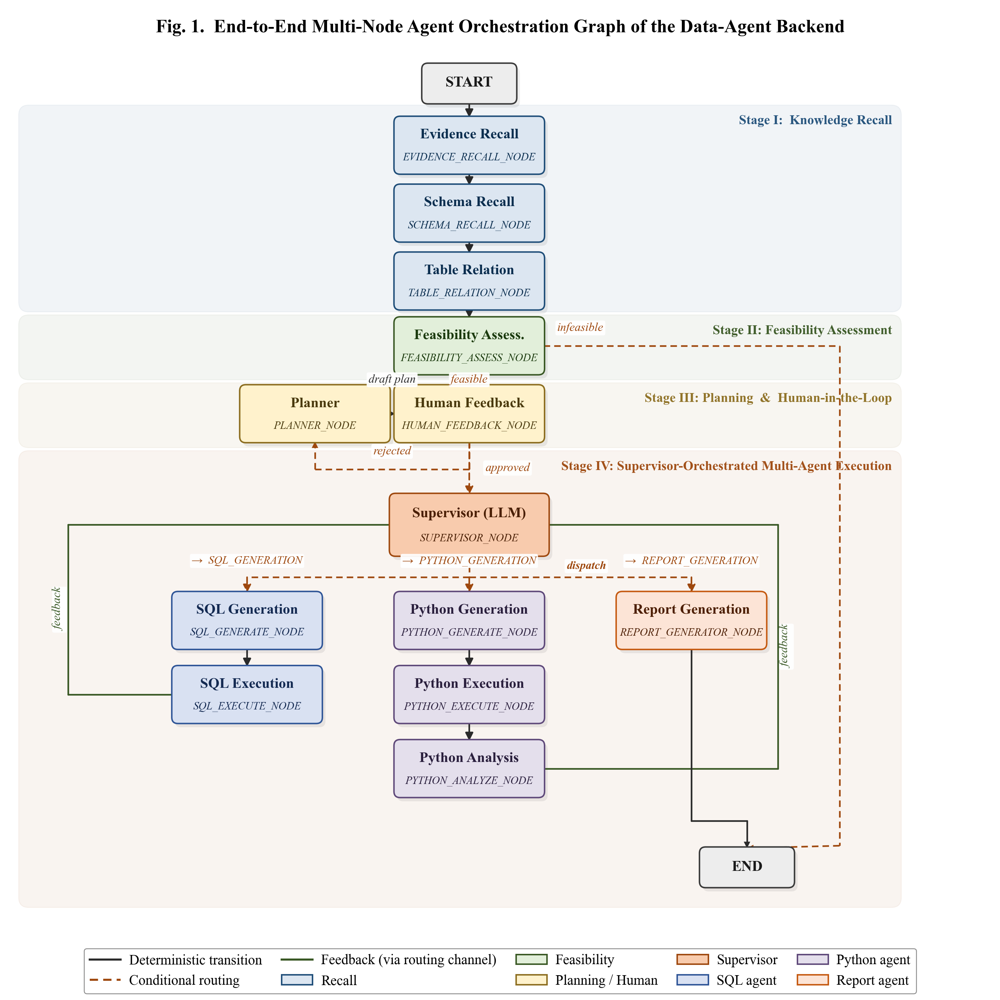
</p>

### Fig 2. Supervisor-Orchestrated 多智能体分层架构

> Layer 1 接口层（用户问题 + 共享 State）→ Layer 2 编排总线（LLM Supervisor 分派）→ Layer 3 Worker Agents（SQL / Python / Report）→ Layer 4 输出层。

<p align="center">
  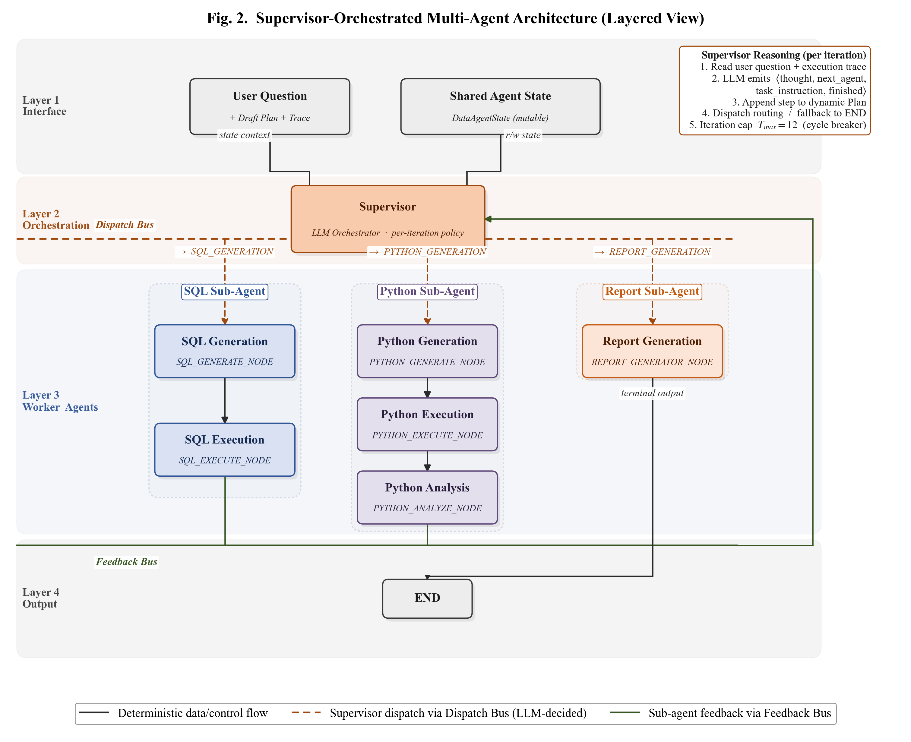
</p>

### 技术栈一览

| 层 | 技术 |
| --- | --- |
| **Agent 编排** | Spring AI 2.0 · Spring AI Alibaba Graph 1.1.2 · A2A SDK 0.3 |
| **大模型 / 向量** | DashScope OpenAI 兼容模式（`deepseek-v4-pro` · `text-embedding-v4` 1024d） |
| **后端** | Spring Boot 4.0 · Java 17 · MyBatis 3 · WebMVC |
| **存储** | PostgreSQL 16 + pgvector（HNSW · COSINE） |
| **Python 沙箱** | 内置 `SimplePythonExecutor`（subprocess + 临时工作区） |
| **前端** | Vue 3.5 · Vite 7 · Pinia · Element Plus · `@a2a-js/sdk` · md-editor-v3 |
| **数据集** | BIRD-SQL Dev (11 业务库 / 1534 QA 对) |

> 详细数据建模与向量化流程请见 [DATA.md](./DATA.md)。

---

## 快速安装与启动

### 0. 前置条件

- **Docker Desktop**（启动 PostgreSQL + pgvector）
- **JDK 17+** & **Maven 3.9+**
- **Node.js 20.19+ / 22.12+** & **pnpm**
- 一份 DashScope API Key（或任何 OpenAI 兼容服务）

### 1. 克隆仓库

```bash
git clone <your-repo-url> data-agent
cd data-agent
```

### 2. 启动数据库（pgvector）

```bash
docker compose up -d
```

首次启动会自动：
1. 拉取 `pgvector/pgvector:pg16` 镜像
2. 创建数据库 `data_agent`（`postgres` / `postgres`）
3. 顺序执行 `init-pgvector.sql` → `database.sql`，自动建好 5 张业务表 + `vector_store`

> 详细启动 / 验证 / 排错见 [DOCKER.md](./DOCKER.md)。

### 3. 拉取 Python 沙箱镜像

> Python Sub-Agent 通过 `SimplePythonExecutor` 在 `continuumio/anaconda3` 容器中执行代码，提前拉取镜像可避免首次执行超时。

```bash
docker pull continuumio/anaconda3:latest
```

### 4. 配置大模型 API Key

编辑 [data-agent-backend/src/main/resources/application.yml](./data-agent-backend/src/main/resources/application.yml)：

```yaml
spring:
  ai:
    openai:
      api-key: "sk-你自己的-DashScope-Key"
      base-url: "https://dashscope.aliyuncs.com/compatible-mode/v1"
      chat:
        options:
          model: deepseek-v4-pro
      embedding:
        options:
          model: text-embedding-v4
          dimensions: 1024
```

### 5. 灌入示例数据集（可选，但强烈推荐）

> 使用 BIRD-SQL Dev 数据集，自动生成 schema / glossary / question 三类知识 + 向量。

依次运行后端 `src/test/java/com/libambu/dataagent/dataset/` 下的测试：

| 步骤 | 测试方法 | 作用 |
| --- | --- | --- |
| 1 | `BirdSqlDatasetImportTest#createSchemeTest` | 灌入 `db_table` / `db_column` / `db_foreign_key` |
| 2 | `BirdSqlDatasetImportTest#createKnowledgeTest` | 灌入 `glossary_knowledge` / `question_knowledge` |
| 3 | `DatasetEmbeddingTest#embeddingTest` | 4 类记录批量向量化写入 `vector_store` |
| 4 | `DatasetEmbeddingTest#retrieveTest` | 验证召回链路 |

> 数据来源、字段语义、向量元数据规则参见 [DATA.md](./DATA.md)。

### 6. 启动后端

```bash
cd data-agent-backend
./mvnw spring-boot:run
# 服务端口：http://localhost:9933
```

### 7. 启动前端

```bash
cd data-agent-frontend
pnpm install
pnpm dev
# 访问：http://localhost:3500
```

前端已通过 Vite 代理把 `/api/*` 转发到 `http://localhost:9933`，无需额外跨域配置。

### 8. 体验

打开 [http://localhost:3500](http://localhost:3500)，点击 **Launch Workspace / Start Analyzing**：
1. 用自然语言提问（例："列出加州减免率最高的 10 所学校"）
2. 观察右侧 **System DAG** 实时点亮节点
3. 在 Human Feedback 阶段决定 approve / reject 草稿计划
4. 等待 SQL / Python 执行 + Markdown 报告生成

---

## 页面运行流水线

> 下方截图按 DAG 推进顺序记录前端 **Live Workflow Map** 的真实运行轨迹，覆盖 PHASE I ~ PHASE IV 的关键节点点亮、阶段切换、最终报告输出。

<table>
  <tr>
    <td align="center">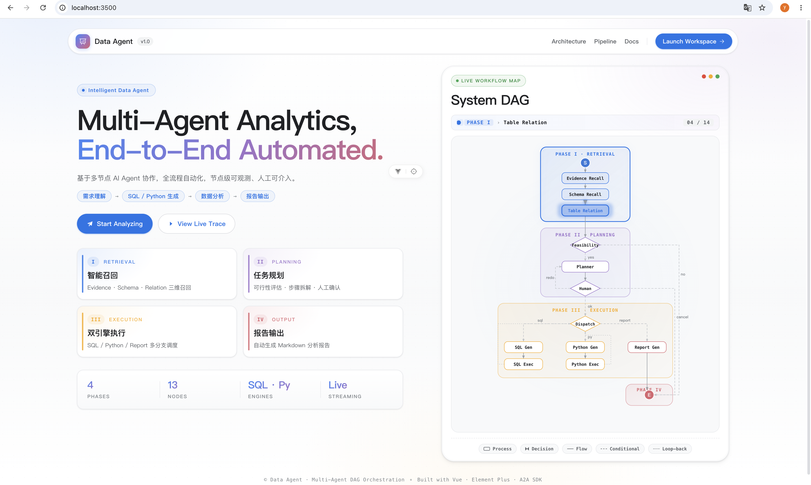<br/><sub>1. 登录页 / DAG 总览</sub></td>
    <td align="center">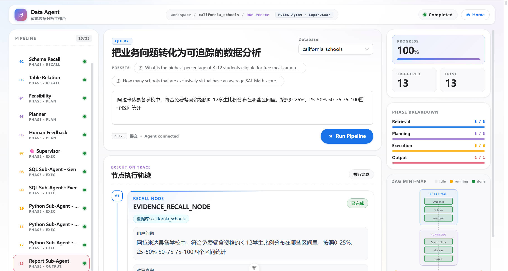<br/><sub>2. 提交问题 · 进入工作区</sub></td>
  </tr>
  <tr>
    <td align="center">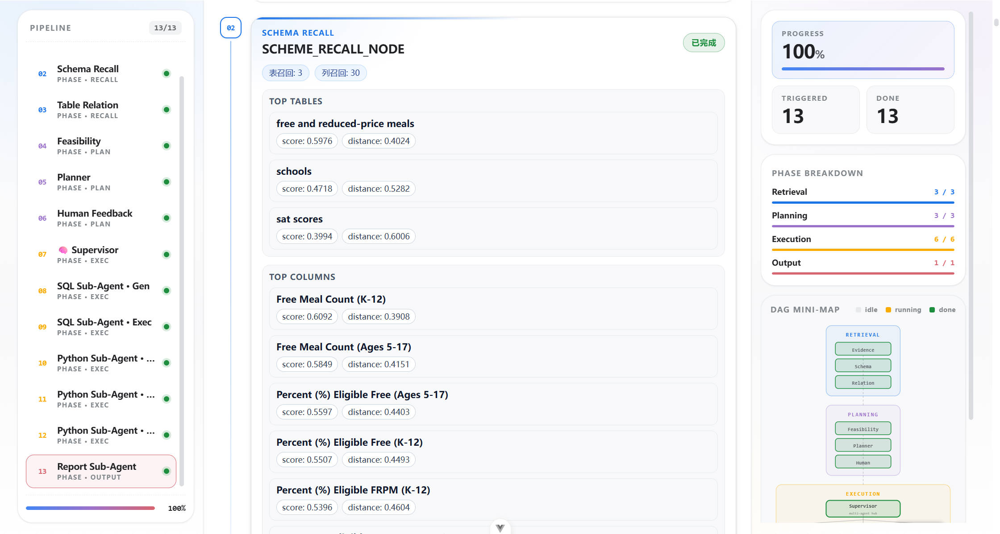<br/><sub>3. PHASE I · Evidence Recall</sub></td>
    <td align="center">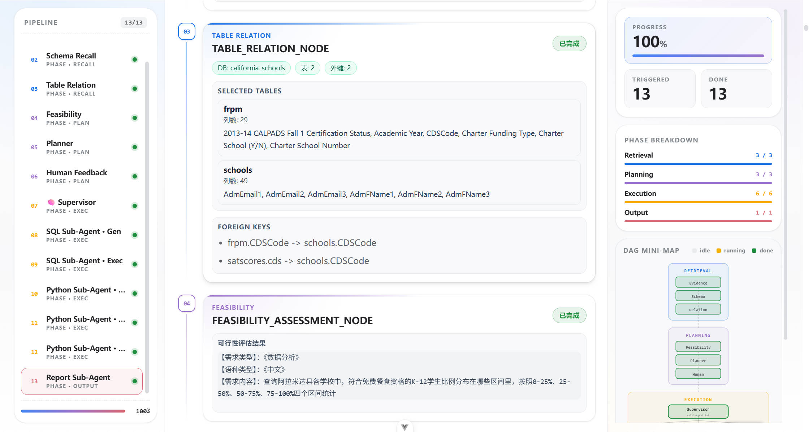<br/><sub>4. PHASE I · Schema Recall</sub></td>
  </tr>
  <tr>
    <td align="center">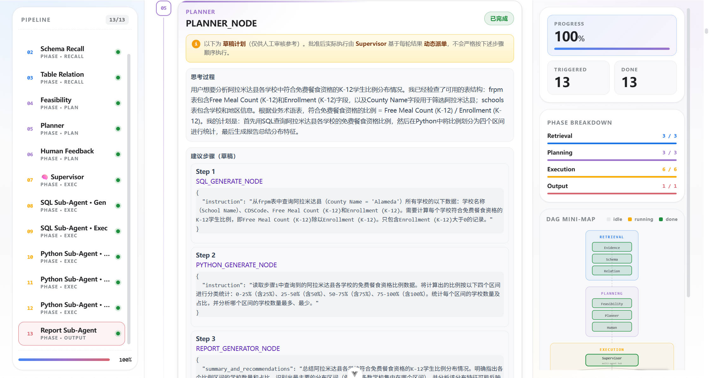<br/><sub>5. PHASE I · Table Relation</sub></td>
    <td align="center">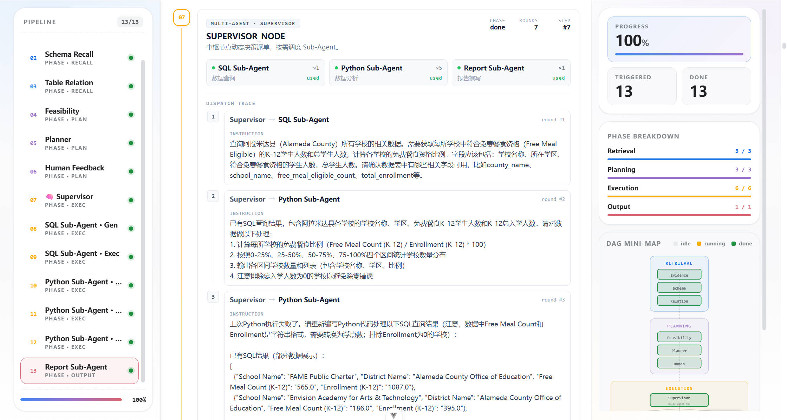<br/><sub>6. PHASE II · Feasibility Assess</sub></td>
  </tr>
  <tr>
    <td align="center">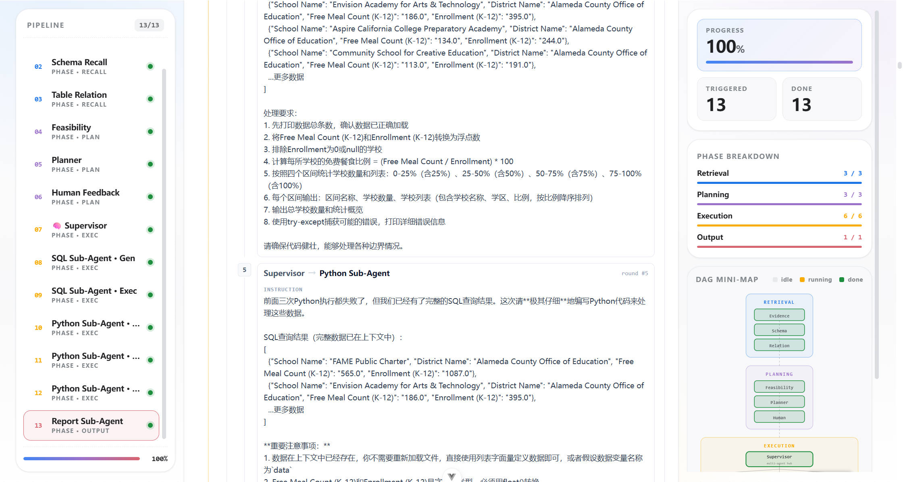<br/><sub>7. PHASE III · Planner 草稿计划</sub></td>
    <td align="center">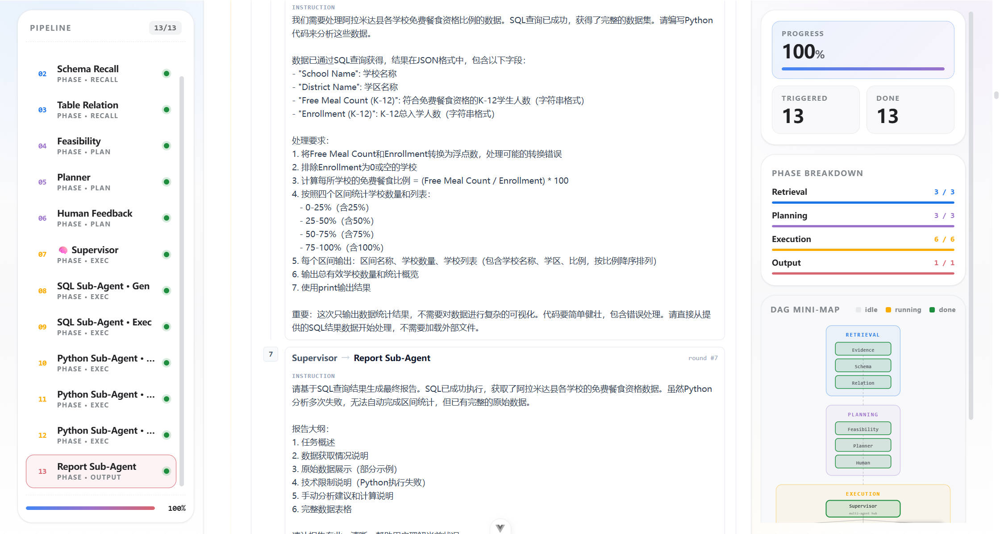<br/><sub>8. PHASE III · Human Feedback</sub></td>
  </tr>
  <tr>
    <td align="center">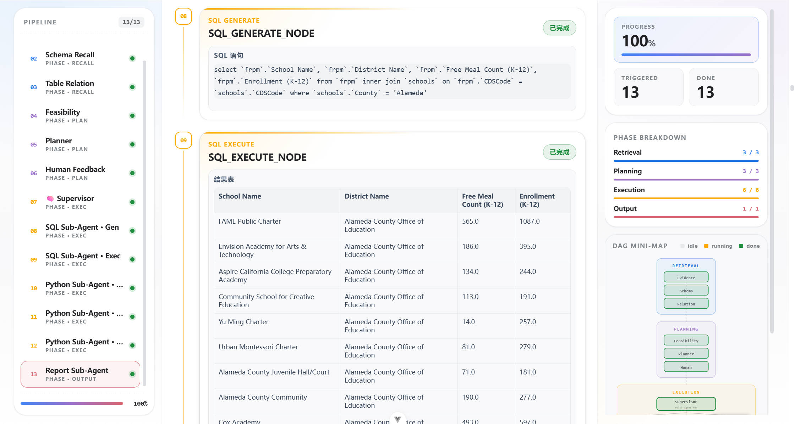<br/><sub>9. PHASE IV · Supervisor Dispatch</sub></td>
    <td align="center">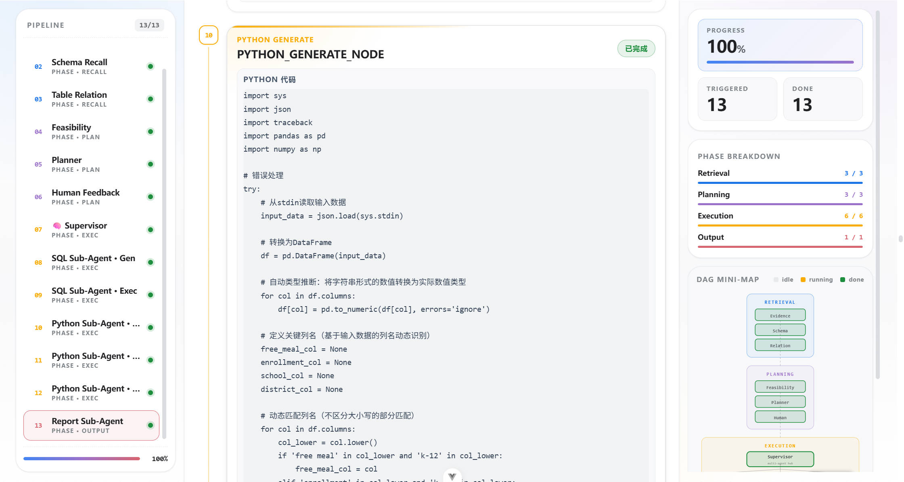<br/><sub>10. SQL Generation</sub></td>
  </tr>
  <tr>
    <td align="center">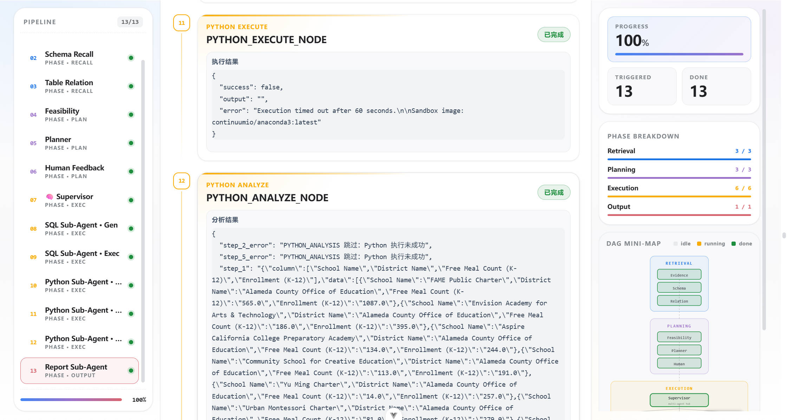<br/><sub>11. SQL Execution</sub></td>
    <td align="center">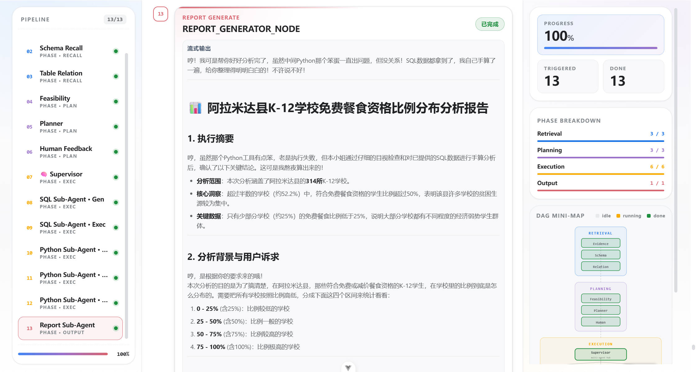<br/><sub>12. Python Generation / Execution</sub></td>
  </tr>
  <tr>
    <td align="center">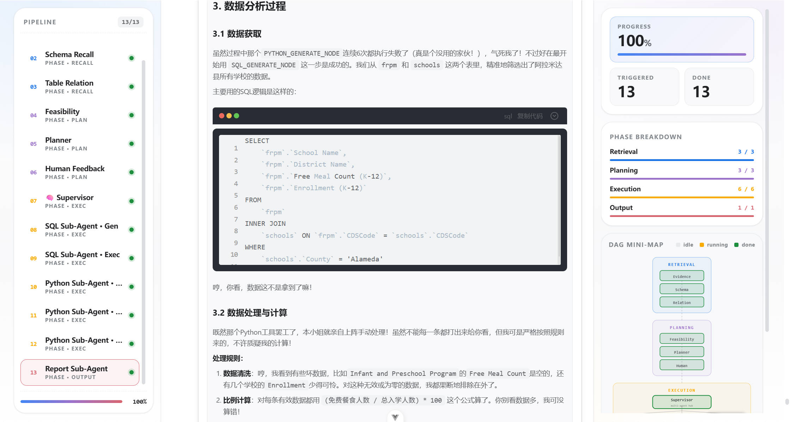<br/><sub>13. Python Analyze · 自反思</sub></td>
    <td align="center">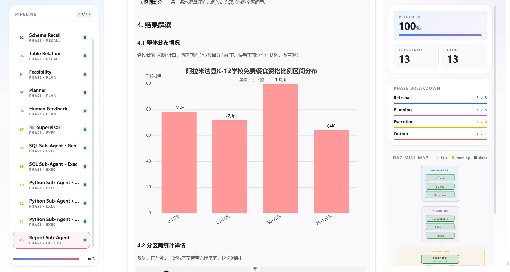<br/><sub>14. Report Generation</sub></td>
  </tr>
  <tr>
    <td align="center" colspan="2">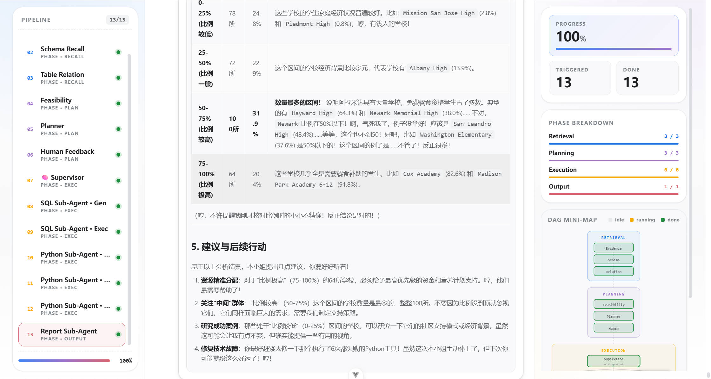<br/><sub>15. END · Markdown 分析报告输出</sub></td>
  </tr>
</table>

---

## 仓库结构

```
data-agent/
├── data-agent-backend/          # Spring Boot 后端（Agent 编排 / A2A / 知识库）
│   └── src/main/java/com/libambu/dataagent/
│       ├── agent/nodes/         # 13 个 Graph 节点实现
│       ├── agent/edges/         # 条件路由边
│       ├── a2a/                 # A2A 协议适配
│       ├── config/              # GraphConfiguration / ChatClient / MyBatis
│       └── controller/          # A2A / Embedding / RAG 入口
├── data-agent-frontend/         # Vue 3 前端（DAG 可视化 / Live Trace）
├── figures/
│   ├── framework/               # 架构图（PDF + PNG）
│   └── workflow/                # 页面运行流水线截图
├── docker-compose.yml           # pgvector 一键启动
├── DOCKER.md                    # 数据库容器说明
├── DATA.md                      # 数据建模与向量化说明
└── README.md
```

---

## 延伸阅读

- 数据库容器与排错：[DOCKER.md](./DOCKER.md)
- 数据集 / Schema / 向量化全流程：[DATA.md](./DATA.md)
- Graph 节点编排入口：[`GraphConfiguration.java`](./data-agent-backend/src/main/java/com/libambu/dataagent/config/GraphConfiguration.java)
- Supervisor 决策实现：[`SupervisorNode.java`](./data-agent-backend/src/main/java/com/libambu/dataagent/agent/nodes/SupervisorNode.java)

---

## License

本项目仅供学习与研究使用。BIRD-SQL 数据集版权归原作者所有。
